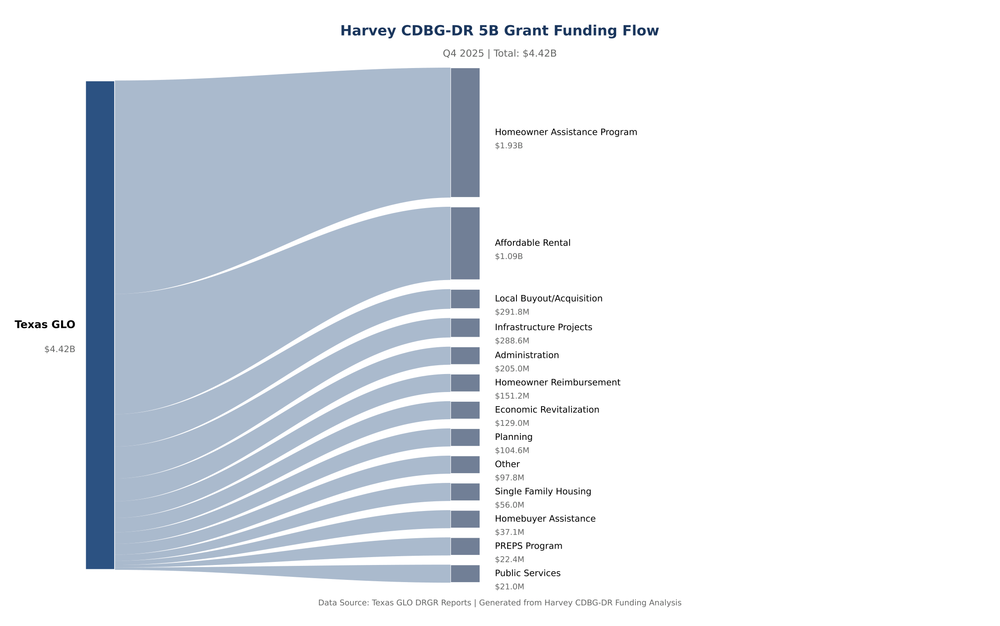
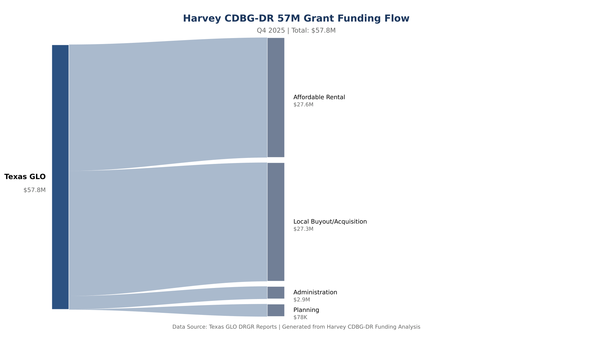
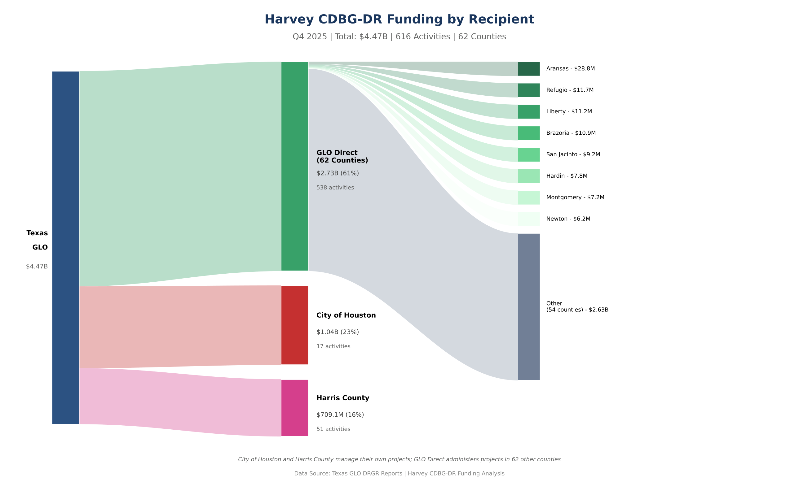

# Narrative Signals as Leading Indicators of Disaster Recovery Program Execution

This repository contains the data, analysis code, and manuscripts for an NLP study of how quarterly narrative reports from the Texas General Land Office (GLO) — the state agency administering federal CDBG-DR disaster recovery grants — predict and reflect actual program execution. We apply natural language processing to 442 quarterly progress reports spanning approximately $10.5 billion in federal disaster recovery funding across Hurricane Harvey, Hurricane Ike, 2015–2019 flood events, and mitigation programs. The core finding: textual signals in agency narratives systematically lead observable program outcomes by one to two quarters, offering a practical early-warning mechanism for recovery program management.

**GLO** = Texas General Land Office. **CDBG-DR** = Community Development Block Grant – Disaster Recovery, the federal program administered by HUD through which Texas received this funding.

---

## Manuscripts

The primary output of this project is a peer-review-ready working paper. Both files are in the repository root.

**Canonical manuscript:**

- [Narrative-Signals-as-Leading-Indicators-of-Disaster-Recovery-Program-Execution_2026-03-02.pdf](Narrative-Signals-as-Leading-Indicators-of-Disaster-Recovery-Program-Execution_2026-03-02.pdf) — PDF (recommended for reading)
- [Narrative-Signals-as-Leading-Indicators-of-Disaster-Recovery-Program-Execution_2026-03-02.docx](Narrative-Signals-as-Leading-Indicators-of-Disaster-Recovery-Program-Execution_2026-03-02.docx) — Word source

**Companion / condensed version:**

- [From-Narrative-Signals-to-Recovery-Execution_2026-03-02.pdf](From-Narrative-Signals-to-Recovery-Execution_2026-03-02.pdf) — shorter companion paper (PDF)
- [From-Narrative-Signals-to-Recovery-Execution_2026-03-02.docx](From-Narrative-Signals-to-Recovery-Execution_2026-03-02.docx) — Word source

---

## What This Study Does

Texas GLO submits quarterly Disaster Recovery Grant Reporting (DRGR) reports to HUD. Each report contains structured financial data and free-text progress narratives describing program activity, obstacles, and planned actions. We ask: **do the words agencies use predict what their programs will do next?**

To answer this we:

1. Extract and structure text from all 442 DRGR reports (153,540 pages; 175,208 tables)
2. Apply six NLP analysis layers: section segmentation, topic clustering (40 topics), entity resolution, co-occurrence relation extraction, money-mention classification, and SEM construct signal derivation
3. Build quarterly panel datasets at state, disaster, county, and city levels
4. Estimate structural equation models (SEM) linking narrative signals (topics, sentiment, entity density) to financial execution outcomes one and two quarters forward

The project tracks $10.46B total across all covered disasters, with $7.59B (73%) expended as of Q4 2025.

---

## Funding Scope

| Disaster | Obligated | Expended | Completion |
|---|---|---|---|
| Hurricane Harvey (2017) | $4.63B | $3.85B | 83% |
| Hurricane Ike (2008) | $2.82B | $2.75B | 98% |
| 2015–2018 Mitigation | $2.49B | $588M | 24% |
| Other Disasters | $526M | $356M | 68% |
| **Total** | **$10.46B** | **$7.59B** | **73%** |

---

## Funding Flows (Harvey)

#### Harvey 5B Infrastructure Grant ($4.42B)

Largest allocations: Homeowner Assistance ($1.93B, 43.6%), Affordable Rental ($1.09B, 24.6%), Infrastructure Projects ($289M, 6.5%).

#### Harvey 57M Housing Grant ($57.8M)

Focuses on Affordable Rental ($27.6M) and Local Buyout/Acquisition ($27.3M).

#### Funding by Recipient Organization

Houston Metro Area (City of Houston + Harris County) receives $1.74B (39%). Texas GLO administers the remaining $2.73B (61%) directly across 62 counties.

> All values are budget allocations as of Q4 2025, not actual expenditures.

---

## Repository Map

| Path | Contents |
|---|---|
| `Narrative-Signals-as-Leading-Indicators-*.docx/.pdf` | Canonical manuscript (root) |
| `From-Narrative-Signals-to-Recovery-Execution_*.docx/.pdf` | Companion paper (root) |
| `src/` | Core NLP and analysis modules (32 Python modules) |
| `scripts/` | Build scripts: model-ready datasets, SEM inputs, portal, reports |
| `outputs/model_ready/` | Analysis-ready panel CSVs (state/disaster/county/city × quarter) |
| `outputs/exports/` | Organized CSV/JSON exports: Harvey, spatial, NLP, general |
| `outputs/visualizations/` | Sankey diagrams and standalone Harvey dashboard |
| `outputs/reports/` | Self-contained HTML reports on Harvey fund switching and housing progress |
| `outputs/sem/` | SEM estimation inputs, results, and legacy comparison artifacts |
| `data/national_grants/` | HUD CDBG-DR national grants reference data (committed) |
| `data/reference/` | County FIPS lookups and boundary references |
| `notebooks/` | Jupyter exploration notebooks |
| `docs/` | Full documentation (see [docs/README.md](docs/README.md)) |
| `TEAM_PORTAL.html` | Click-to-open team hub: dashboards, maps, key tables |

### Data not committed to this repository

- `DRGR_Reports/` — 442 source PDF reports (~large); download separately (see [docs/SETUP.md](docs/SETUP.md))
- `data/*.db` — SQLite database (~2.5 GB); rebuilt from source PDFs
- `data/extracted_text/`, `data/extracted_tables/` — pipeline-generated; rebuildable
- `external/` — external subproject (~360 MB); managed separately
- `outputs/sem/`, `output/`, `tmp/` — generated outputs; rebuildable

---

## Note on Data

The NLP layer extracts dollar amounts from narrative text and classifies each mention as budget, expended, obligated, or drawdown based on surrounding keywords. These are **text mentions**, not validated ledger entries — use them for trend analysis and to identify where amounts are discussed. For official financial totals, use `outputs/exports/general/texas_disaster_financial_summary.csv` and the national grants tables in `data/national_grants/`.

---

## Reproducibility

The analysis pipeline requires Python 3.12+ and the source PDFs (not committed). Full environment setup and pipeline instructions are in [docs/SETUP.md](docs/SETUP.md). Step-by-step operational workflows are in [docs/WORKFLOWS.md](docs/WORKFLOWS.md). The analysis-ready datasets in `outputs/model_ready/` and exports in `outputs/exports/` are committed and can be used directly for statistical replication without re-running the full NLP pipeline.

---

## Documentation

### For readers and researchers

- [Start Here (Non-Technical)](docs/START_HERE.md) — plain-language project walkthrough
- [Analysis Report](docs/ANALYSIS_REPORT.md) — narrative summary of pipeline findings
- [Glossary](docs/GLOSSARY.md) — terms used across outputs and tables
- [Model-Ready Datasets](docs/MODEL_READY.md) — dataset catalog for EDA and statistical modeling
- [SEM Data Guide](docs/SEM_DATA.md) — SEM panel schema, construct derivations, and provenance
- [Modeling Variables](docs/MODELING_VARIABLES.md) — SEM construct triage and coverage

### For developers and contributors

- [Docs Index](docs/README.md) — recommended reading order by audience
- [Setup Guide](docs/SETUP.md) — installation, configuration, and first run
- [Architecture](docs/ARCHITECTURE.md) — system design and data flow (9 phases)
- [Database Schema](docs/DATABASE.md) — SQLite table structures and example queries
- [Module Reference](docs/MODULES.md) — Python module documentation (32 modules)
- [Workflows](docs/WORKFLOWS.md) — step-by-step pipeline and operational runbooks
- [NLP Analyses](docs/ANALYSES.md) — topics, sections, relations, money-context layers
- [Spatial Mapping](docs/SPATIAL.md) — location extraction and choropleth map exports
- [Data Formats](docs/DATA.md) — exported file formats and schemas
- [GitHub Sharing Guide](docs/GITHUB_SHARING.md) — what is committed vs. shared externally

---

## Data Sources

- **DRGR Reports**: [Texas GLO CDBG-DR Reports](https://www.glo.texas.gov) — public government documents
- **National Grants**: Derived from HUD CDBG-DR program data (see `data/national_grants/`)
