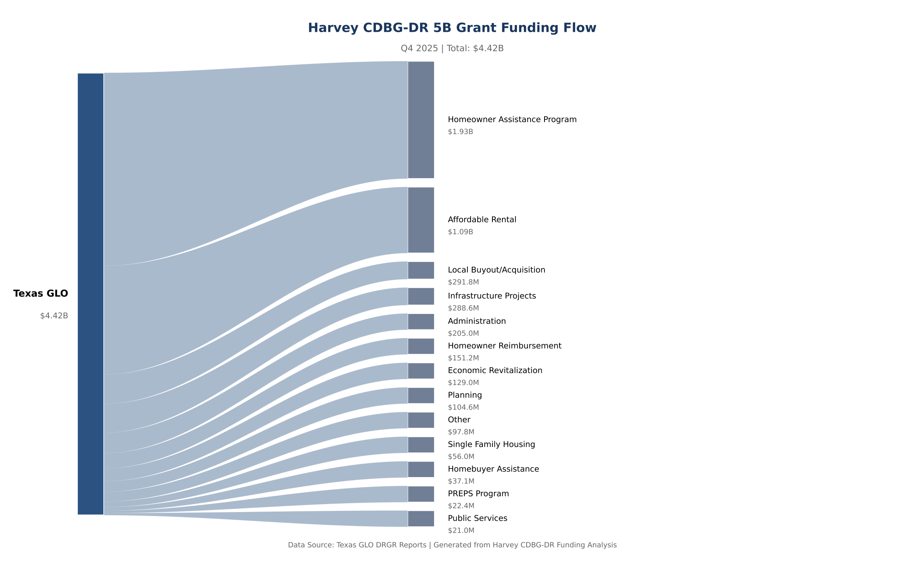
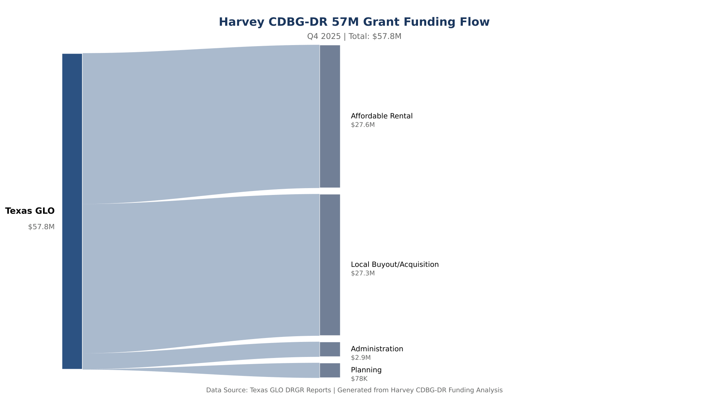
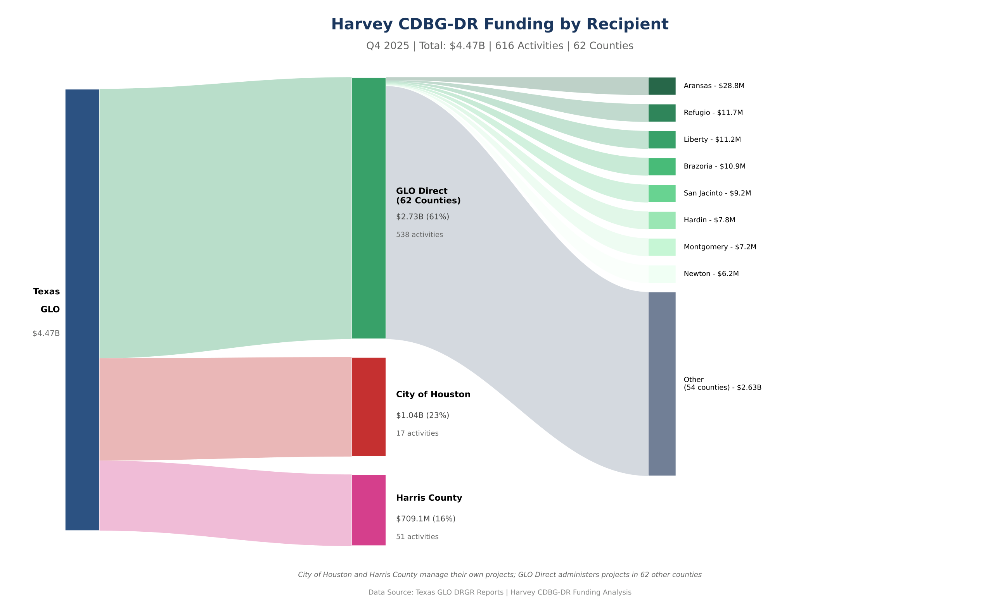

# Harvey CDBG-DR Funding Flow Analysis

A comprehensive analysis of Hurricane Harvey disaster recovery funding from HUD allocations through Texas GLO to local expenditures.

---

## Executive Summary

This analysis tracks **$4.47 billion** in Hurricane Harvey CDBG-DR funding across **616 activities** spanning **62 Texas counties**. The data covers quarterly DRGR reports from 2018 through Q4 2025, providing visibility into where funds were allocated versus where they ended up.

### Key Findings

| Metric | Value |
|--------|-------|
| Total Budget Tracked | $4,474,546,991 |
| Activities | 616 (latest quarter) |
| Unique Activity Codes | 1,169 (across all quarters) |
| Quarters Analyzed | 25 |
| Organizations | 3 primary recipients |
| Counties | 62 |
| Completion Rate | 12.5% (Infrastructure) |

---

## 1. Data Sources

### Documents Processed

| Category | Documents | Description |
|----------|-----------|-------------|
| Harvey_5B_Performance | 29 | Infrastructure quarterly reports |
| Harvey_5B_ActionPlan | 25 | Infrastructure action plans |
| Harvey_57M_Performance | 29 | Housing quarterly reports |
| Harvey_57M_ActionPlan | 23 | Housing action plans |
| **Total** | **106** | All Harvey documents |

### Grant Numbers

| Grant | Program | Amount |
|-------|---------|--------|
| B-17-DM-48-0001 | Infrastructure (Most Impacted) | $5,024,215,000 |
| B-18-DP-48-0001 | Infrastructure (Mitigation) | $652,175,000 |
| B-17-DL-48-0002 | Housing | $57,800,000 |
| **Total Appropriated** | | **$5,734,190,000** |

---

## 2. Funding Flow Structure

```
                           HUD
                            │
                   $4.47B   │
                            ▼
                       Texas GLO
                      /         \
             $4.42B /           \ $57.8M
                   /             \
        Infrastructure         Housing
              │                    │
    ┌─────────┼─────────┐    ┌────┴────┐
    │         │         │    │         │
$1.04B    $709M    $2.72B   $43.9M   $2.97M
    │         │         │    │         │
City of   Harris   Texas  Harris   Texas
Houston   County    GLO   County    GLO
                   Direct         Direct
```

### Program Breakdown (Q4 2025)

| Program | Allocated | Activities | % of Total |
|---------|-----------|------------|------------|
| Infrastructure | $4,416,746,991 | 586 | 98.7% |
| Housing | $57,800,000 | 30 | 1.3% |

---

## 3. Geographic Distribution

### Top 10 Counties by Funding

| Rank | County | Allocated | Activities |
|------|--------|-----------|------------|
| 1 | Aransas County | $28,797,242 | 3 |
| 2 | Refugio County | $11,727,057 | 6 |
| 3 | Liberty | $11,155,242 | 5 |
| 4 | Brazoria | $10,917,829 | 1 |
| 5 | San Jacinto | $9,195,614 | 4 |
| 6 | Hardin County | $7,826,815 | 4 |
| 7 | Montgomery | $7,175,793 | 3 |
| 8 | Newton | $6,171,946 | 3 |
| 9 | Nueces County | $4,645,556 | 2 |
| 10 | Galveston County | $4,235,621 | 2 |

### Notable Observations

- **Urban vs Rural**: While Harris County received significant funding through Harris County and City of Houston as organizations, many individual county-level activities went to smaller coastal and rural counties hit by Harvey.
- **Coastal Impact**: Aransas, Refugio, and other coastal counties show high per-activity funding, reflecting direct hurricane impact.
- **Statewide Distribution**: 62 counties have tracked activities, covering most of the 49 CDBG-DR eligible counties.

---

## 4. Organization Analysis

### Primary Recipients

| Organization | Infrastructure | Housing | Total |
|--------------|---------------|---------|-------|
| Texas GLO Direct | $2,716,139,604 | $10,952,932 | $2,727,092,536 |
| City of Houston | $1,035,382,737 | - | $1,035,382,737 |
| Harris County | $665,224,650 | $43,879,068 | $709,103,718 |

### Observations

1. **Texas GLO Direct**: Administers 87% of Infrastructure activities directly, primarily smaller local government projects
2. **City of Houston**: Large urban block grant with 17 major activities
3. **Harris County**: Significant buyout and acquisition programs through both Infrastructure and Housing grants

---

## 5. Activity Status

### Completion Rates by Program (Q4 2025)

| Program | Total | Completed | In Progress | Cancelled | Rate |
|---------|-------|-----------|-------------|-----------|------|
| Infrastructure | 586 | 73 | 469 | 44 | 12.5% |
| Housing | 30 | 0 | 0 | 30 | 0.0% |

### Status by Activity Category

| Category | Total | Completed | Rate |
|----------|-------|-----------|------|
| PREPS Program | 2 | 2 | 100% |
| Infrastructure | 234 | 43 | 18.4% |
| Local Buyout/Acquisition | 228 | 28 | 12.3% |
| Administration | 4 | 0 | 0% |
| City of Houston | 23 | 0 | 0% |
| Harris County | 21 | 0 | 0% |

### Key Insight

The low completion rate (12.5%) for Infrastructure activities is notable 8+ years after Hurricane Harvey (August 2017). This reflects:
- Complex multi-year infrastructure projects
- Environmental review requirements
- Procurement and contracting timelines
- Local government capacity constraints

---

## 6. Quarterly Trends

### Budget Tracking Over Time

The analysis tracks 25 quarters of data from 2018 to Q4 2025, showing:

1. **Ramping Period (2018-2019)**: Initial activity setup and planning
2. **Growth Phase (2020-2021)**: Rapid activity creation and budget allocation
3. **Execution Phase (2022-2024)**: Steady progress on activities
4. **Current State (2025)**: 616 active activities, 12.5% completion

### Activity Count Progression

Activities grew from initial program setup to ~600+ as subrecipient agreements were established with local governments.

---

## 7. Comparison to National Grants Data

### National CDBG-DR Totals for Harvey

| Metric | National Data | Local Tracking | Coverage |
|--------|---------------|----------------|----------|
| Total Obligated | $4,630,000,000 | $4,474,546,991 | 96.6% |
| Expenditure Rate | 83.2% | N/A* | - |

*Local tracking captures allocations; expenditure data requires additional DRGR fields not currently parsed.

### Interpretation

Our activity-level tracking captures **96.6%** of the nationally reported obligated amount, indicating strong coverage of Harvey funding flows.

---

## 8. Sankey Diagram Visualizations

### Harvey 5B Infrastructure Grant ($4.42B)



This diagram shows the Q4 2025 budget allocations for the Harvey Infrastructure grant flowing from Texas GLO to 13 program categories.

### Harvey 57M Housing Grant ($57.8M)



The smaller 57M Housing grant focuses on Affordable Rental and Local Buyout/Acquisition programs.

### Harvey Funding by Recipient Organization



This diagram shows how funds flow to recipient organizations:
- **GLO Direct Administration**: $2.73B (61%) - Texas GLO administers projects directly in 62 counties
- **City of Houston**: $1.04B (23%) - Manages their own projects
- **Harris County**: $709M (16%) - Manages their own projects

The right side breaks down GLO Direct administration by top counties: Aransas ($28.8M), Refugio ($11.7M), Liberty ($11.2M), and others.

### Flow Structure

```
Level 0: HUD (Source)
    │
    └──> Level 1: Texas GLO ($4.47B)
              │
              ├──> Level 2: Infrastructure ($4.42B)
              │         │
              │         ├──> Level 3: City of Houston ($1.04B)
              │         ├──> Level 3: Harris County ($665M)
              │         └──> Level 3: Texas GLO Direct ($2.72B)
              │
              └──> Level 2: Housing ($57.8M)
                        │
                        ├──> Level 3: Harris County ($43.9M)
                        └──> Level 3: Texas GLO ($2.97M)
```

### Top 10 Funding Flows

| Source | Target | Amount |
|--------|--------|--------|
| HUD | Texas GLO | $4,474,546,991 |
| Texas GLO | Infrastructure | $4,416,746,991 |
| Infrastructure | City of Houston | $1,035,382,737 |
| Infrastructure | Harris County | $665,224,650 |
| Texas GLO | Housing | $57,800,000 |
| Housing | Harris County | $43,879,068 |
| Housing | Texas GLO | $2,968,000 |

---

## 9. Data Quality Notes

### Parsing Accuracy

| Field | Extraction Rate | Notes |
|-------|-----------------|-------|
| Activity Code | 100% | Captured from all blocks |
| Total Budget | 95%+ | Both format variations handled |
| Status | 85%+ | Under Way, Completed, Cancelled |
| Responsible Org | 60% | Only explicit mentions captured |
| County | 50% | Extracted from activity codes |

### Limitations

1. **Expenditure Data**: DRGR reports contain budget allocations; actual drawdown/expenditure amounts require parsing additional fields
2. **County Coverage**: Not all activities have county in their code; some are statewide or multi-county
3. **Historical Completeness**: Earlier quarters may have fewer activities as programs were still being established

---

## 10. Files Generated

### Database Tables

| Table | Records | Description |
|-------|---------|-------------|
| harvey_activities | 14,850 | All activity records across quarters |
| harvey_quarterly_totals | ~150 | Aggregated quarterly data |
| harvey_org_allocations | ~200 | By organization per quarter |
| harvey_county_allocations | ~500 | By county per quarter |
| harvey_funding_changes | ~5,000 | Quarter-over-quarter changes |

### Export Files

| File | Format | Size | Description |
|------|--------|------|-------------|
| harvey_sankey_data.json | JSON | 2KB | D3.js Sankey visualization data |
| harvey_sankey_infrastructure.json | JSON | 3KB | Infrastructure grant Sankey data |
| harvey_sankey_housing.json | JSON | 1KB | Housing grant Sankey data |
| harvey_sankey_recipients.json | JSON | 2KB | Recipient organization Sankey data with county breakdown |
| harvey_quarterly_trends.json | JSON | 15KB | Time series data |
| harvey_funding_hierarchy.json | JSON | 8KB | Hierarchical structure |
| harvey_org_allocations.csv | CSV | 20KB | Organization-level data |
| harvey_county_allocations.csv | CSV | 50KB | County-level data |

### Visualization Files

| File | Format | Description |
|------|--------|-------------|
| harvey_sankey_5b.pdf | PDF | Infrastructure grant Sankey (print quality) |
| harvey_sankey_5b.png | PNG | Infrastructure grant Sankey (web display) |
| harvey_sankey_57m.pdf | PDF | Housing grant Sankey (print quality) |
| harvey_sankey_57m.png | PNG | Housing grant Sankey (web display) |
| harvey_sankey_recipients.pdf | PDF | Recipient organization Sankey (print quality) |
| harvey_sankey_recipients.png | PNG | Recipient organization Sankey (web display) |
| generate_sankey_matplotlib.py | Python | Sankey generator using matplotlib |
| generate_sankey_recipients.py | Python | Recipient Sankey generator using matplotlib |

---

## 11. Usage Examples

### Query Funding by County

```python
from harvey_queries import HarveyQueries

hq = HarveyQueries()
df = hq.get_funding_by_county()
print(df.head(10))
```

### Get Activity Details

```python
details = hq.get_activity_details('INF_HMID_LMI_20-065-001-B947_Galveston')
print(details)
```

### Generate Sankey Data

```bash
python src/funding_tracker.py --sankey
```

---

## 12. Conclusions

### Where Did Harvey Funds End Up?

1. **Infrastructure Dominates**: 98.7% of tracked funds ($4.42B) went to Infrastructure programs
2. **Local Government Focus**: Texas GLO administers most projects directly with local government subrecipients
3. **Urban Concentration**: City of Houston and Harris County received $1.7B combined (38% of total)
4. **Coastal Distribution**: Aransas, Refugio, and other coastal counties received proportionally high per-capita funding

### Allocation vs. Outcomes

- **High Allocation, Low Completion**: Despite 8+ years since Harvey, only 12.5% of Infrastructure activities are complete
- **Housing Lag**: The Housing program ($57.8M) shows 0% completion rate for tracked activities
- **Buyout Programs**: Local Buyout/Acquisition activities show 12.3% completion, reflecting the complexity of property acquisition

### Recommendations for Further Analysis

1. **Parse Expenditure Data**: Add parsing for actual drawdown/expenditure amounts from DRGR reports
2. **Track Timeline Changes**: Compare projected vs. actual completion dates
3. **Beneficiary Analysis**: Link to accomplishment data (households served, units built)
4. **Geographic Mapping**: Create choropleth maps of funding by county
5. **National Comparison**: Compare Texas GLO performance to other Harvey grantees

---

## Appendix: Technical Implementation

### Architecture

```
DRGR Reports (106 PDFs)
        │
        ▼
  pdf_processor.py
        │
        ▼
   Extracted Text
        │
        ▼
 financial_parser.py ──► harvey_activities table
        │
        ▼
 funding_tracker.py ──► Sankey/trend exports
        │
        ▼
  harvey_queries.py ──► Analysis API
```

### Key Regex Patterns

```python
# Activity code extraction
r'Projected End Date:\s*([A-Za-z0-9_\[\]\-\.\s]+?)\s+Activity Type:'

# Budget extraction (both formats)
r'(?:Total Budget:\s*\$\s*([\d,]+(?:\.\d{2})?))|\$\s*([\d,]+(?:\.\d{2})?)\s*Total Budget:'

# Status extraction
r'(?:Under Way|Completed|Not Started|Cancelled|Pending Cancellation)'
```

---

*Report generated from Texas GLO NLP Project - Harvey Funding Flow Database*
*Data as of Q4 2025*
